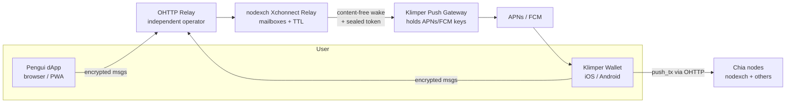

# Xchonnect — XCH Signing Relay Protocol

**Spec for nodexch (relay service) and Klimper (mobile signer), with Pengui as first dApp**

| Field | Value |
|---|---|
| Version | 0.1 |
| Status | Draft — internal, pre-CHIP |
| Normative source | This file (`docs/spec/xchonnect-spec.md` in the xchonnect repository). Copies elsewhere are informative. |
| Changes | See [CHANGELOG.md](CHANGELOG.md) and [PROCESS.md](PROCESS.md) |
| Name | Xchonnect (XCH Signing Relay Protocol); hosted relay product: relayxch (nodexch) |
| Components | nodexch Relay, Klimper Wallet, Push Gateway, Pengui dApp SDK |
| Target | Open protocol (later submitted as a CHIP) + commercial hosted relay in nodexch |

---

## 1. Summary

Xchonnect is an open, push-native, privacy-first transport that lets a dApp (e.g. Pengui) send signing requests to a mobile wallet (e.g. Klimper) and receive signatures back — without persistent WebSockets, without custody, and without the relay learning message contents, Chia addresses, or (with OHTTP) user IP addresses.

Xchonnect is a **transport only**. The method layer reuses **CHIP-0002** (`signCoinSpends`, `getPublicKeys`, …) unchanged, so existing CHIP-0002 dApps can switch transport without new method semantics.

Core idea: phones are never "connected". The relay stores encrypted messages in anonymous mailboxes; a content-free push wakes the wallet; the wallet does one HTTPS round trip and goes back to sleep. This survives iOS/Android background restrictions, where WalletConnect-style WebSocket sessions do not.

---

## 2. Goals and non-goals

### Goals

- **G1 Mobile reliability:** signing requests reliably reach a suspended or closed wallet app on iOS and Android.
- **G2 Non-custodial:** no component other than the wallet ever holds or can derive private keys.
- **G3 Confidentiality:** the relay cannot read or forge requests, responses, or spend data.
- **G4 Minimal metadata:** the relay stores no Chia addresses, public keys, account identities, or IPs; mailboxes are random and rotatable.
- **G5 Open & multi-vendor:** any wallet and any dApp can implement Xchonnect; anyone can run a relay; each wallet vendor keeps control of its own push credentials.
- **G6 Multi-party spends:** supports options and lending flows that combine spends from several parties into one bound spend bundle.
- **G7 Commercially operable:** nodexch can run a metered, SLA-backed hosted relay without identifying end users.

### Non-goals

- Defining spend semantics, fees, coin selection or UI (owned by wallets and dApps).
- Replacing on-chain security (vault recovery, timelocks) — Xchonnect is key-type agnostic and can later carry vault/passkey signatures.
- Anonymity against a global network observer, or against Apple/Google knowing that a device received a push.
- Group chat, general messaging, or file transfer.

---

## 3. Terminology

| Term | Meaning |
|---|---|
| **dApp** | Web or native app requesting signatures (first: Pengui). |
| **Wallet** | App holding keys and signing (first: Klimper). |
| **Relay** | Stateless-ish store-and-forward service for encrypted messages (hosted by nodexch; anyone can run one). |
| **Mailbox** | Anonymous inbox on the relay, addressed by a random ID, accessed with capability tokens. |
| **Read token / write token** | 256-bit random secrets granting read or write access to one mailbox. The relay stores only their hashes. |
| **Push Gateway** | Small service run by the wallet vendor that holds that vendor's APNs/FCM credentials and delivers wake-ups. |
| **Sealed push token** | Device push token encrypted to the Push Gateway's public key, opaque to the relay and dApp. |
| **OHTTP relay** | Independent third-party Oblivious HTTP relay (RFC 9458) that hides client IPs from the Xchonnect relay. |
| **Session** | An established, end-to-end encrypted pairing between one dApp instance and one wallet. |
| **SAS** | Short Authentication String shown on both devices during pairing. |

Key words MUST, SHOULD, MAY follow RFC 2119.

---

## 4. Architecture



### 4.1 Separation of duties

| Component | Sees | Never sees |
|---|---|---|
| OHTTP relay | Client IP, encrypted blob size, timing | Mailbox IDs, content, which Xchonnect relay request |
| Xchonnect relay | Mailbox IDs, ciphertext size, timing, API-key of the *business customer* | Client IP (with OHTTP), content, Chia addresses, device push token |
| Push Gateway | Device push token, that a wake-up happened | Mailbox ID, content, dApp identity |
| APNs / FCM | Device received a push from Klimper | Content (payload is opaque or encrypted) |
| dApp | Its own session, public keys the wallet chose to share | Wallet private keys, device push token |
| Chia node | Signed spend bundle (public anyway after inclusion) | Which device / relay session produced it (if submitted via OHTTP) |

**Requirement:** the nodexch relay service and the nodexch transaction-push (`push_tx`) service MUST run on separate infrastructure with separate logs, so nodexch cannot correlate relay traffic with submitted transactions by timing or IP.

---

## 5. Cryptography

Xchonnect v1 uses only well-reviewed primitives. No custom cryptography.

| Purpose | Primitive |
|---|---|
| Key agreement | X25519 |
| Key derivation | HKDF-SHA256 (RFC 5869) |
| Pairing handshake | HPKE (RFC 9180), mode `psk`, suite DHKEM(X25519, HKDF-SHA256) / HKDF-SHA256 / ChaCha20-Poly1305 |
| Session encryption | XChaCha20-Poly1305 (AEAD, draft-irtf-cfrg-xchacha) with a random 192-bit nonce per message |
| dApp origin signatures | Ed25519 |
| Hashing | SHA-256 |
| Token generation | 256-bit CSPRNG |

### 5.1 Cipher suite agility

- Every envelope carries a protocol version `v`. Suite changes require a new version.
- Implementations MUST reject unknown versions; no downgrade negotiation in v1.

### 5.2 Key schedule

No key pair is used in more than one construction. The dApp's pairing key pair
(`dsk`, `dpk`) is used **only** as the HPKE recipient key; the wallet's contribution is
the HPKE encapsulated key `enc`. All labels are ASCII strings without terminator; `||`
is byte concatenation.

**Inputs.**

| Symbol | Definition |
|---|---|
| `uri_sig_input` | Byte string signed by the origin key (Section 6.2, exact layout in `wire/pairing-uri.md`) |
| `h_uri` | `SHA-256(uri_sig_input)` |
| `s` | 32-byte pairing secret from the URI |
| `mbx_P` | 16-byte dApp pairing mailbox id from the URI (`m`) |

**Pairing (HPKE, RFC 9180, mode `mode_psk`, suite DHKEM(X25519, HKDF-SHA256) /
HKDF-SHA256 / ChaCha20-Poly1305, i.e. KEM 0x0020, KDF 0x0001, AEAD 0x0003):**

```
info        = "xchonnect v1 pairing" || h_uri
psk         = s
psk_id      = "xchonnect v1 psk"
(enc, ctx)  = SetupPSKS(pkR = dpk, info, psk, psk_id)          // wallet
ctx         = SetupPSKR(enc, skR = dsk, info, psk, psk_id)      // dApp
aad_pair    = "xchonnect v1 pairing reply" || mbx_P
ct_pair     = ctx.Seal(aad_pair, canonical_cbor(PairingReply) || zero padding)   // len(ct_pair) = 1024
th          = SHA-256("xchonnect v1 transcript" || h_uri || enc || ct_pair)
root_0      = ctx.Export("xchonnect v1 root" || th, 32)
```

**Per-epoch keys** (epoch `e` = 0 after pairing, incremented by each rotation):

```
k_d2w  = HKDF-Expand(root_e, "xchonnect v1 dapp->wallet", 32)
k_w2d  = HKDF-Expand(root_e, "xchonnect v1 wallet->dapp", 32)
ck_e   = HKDF-Expand(root_e, "xchonnect v1 chain", 32)        // chaining key for rotation
sas    = HKDF-Expand(root_0, "xchonnect v1 sas", 8)            // epoch 0 only
```

`root_e` is used directly as the HKDF PRK (it is 32 uniformly random bytes).

**SAS.** `code = uint64_be(sas) mod 1 000 000`, rendered as six decimal digits with
leading zeros and displayed as two groups of three (`042 917`). The modulo bias is below
2^-44 and is ignored.

**Rotation** (`session.rotate`, Section 9.2). The initiator sends a fresh X25519 public
key `A`; the responder answers with a fresh `B`. Both messages travel inside the current
epoch's authenticated encryption. Then:

```
dh        = X25519(a, B) = X25519(b, A)
th_r      = SHA-256("xchonnect v1 rotate" || uint64_be(e + 1) || A || B)
prk       = HKDF-Extract(salt = ck_e, ikm = dh)
root_e+1  = HKDF-Expand(prk, "xchonnect v1 root" || th_r, 32)
```

Implementations MUST reject an all-zero X25519 output. After switching epochs both sides
MUST erase `root_e`, `ck_e`, the old direction keys and the ephemeral secrets `a`/`b`.

**Erasure.** After `session.ready` the dApp MUST erase `dsk` and `s`; the wallet MUST
erase `s` and the HPKE context once `root_0` is derived.

- Keys are **direction-specific**; a message can never be reflected back.
- Wallets SHOULD rotate at least every 30 days or 10,000 messages.
- A full double ratchet is deferred to v2 (OQ-3, decided).

### 5.3 Envelope format

Messages are CBOR (RFC 8949) using the canonical profile of Section 5.4. Exact CDDL
definitions are in `wire/envelope.cddl`.

**Outer envelope (visible to relay):**

```
Envelope = {
  1: 1,        ; v     protocol version
  2: kind,     ; kind  1 = session message, 2 = pairing reply (Section 6.3)
  3: bstr,     ; n     kind 1: 24-byte random nonce; kind 2: 32-byte HPKE encapsulated key
  4: bstr      ; ct    AEAD ciphertext including the 16-byte tag, padded (see below)
}
```

**Inner plaintext (after decryption, kind 1):**

```
{
  seq:  uint,             // strictly increasing per direction, starts at 1, <= 2^53 - 1
  iat:  uint,             // issued-at, unix seconds
  exp:  uint,             // expiry, unix seconds
  id:   bstr(16),         // random request/response ID
  type: tstr,             // "rpc.request" | "rpc.response" | "rpc.received" | "session.*"
  body: any               // method payload (Section 9)
}
```

- **AEAD:** XChaCha20-Poly1305 under the direction key (`k_d2w` or `k_w2d`, Section 5.2).
- **Nonce:** a fresh 192-bit value from a CSPRNG for every message, carried in field `n`.
  Nonces are never derived from `seq` or any other counter, so restoring older sender
  state cannot cause nonce reuse.
- **AAD:** the 28-byte string
  `"xchonnect"` (9 ASCII bytes) `|| u8 v || u8 kind || u8 direction || recipient_mailbox_id (16 bytes)`,
  where `direction` is `0x01` for dApp→wallet and `0x02` for wallet→dApp.
- **Padding:** the plaintext is the canonical CBOR encoding of the inner map followed by
  zero bytes, so that the ciphertext length (plaintext + 16-byte tag) is exactly one of
  the bucket sizes 1 KiB, 4 KiB, 16 KiB, 64 KiB, 256 KiB (the smallest that fits).
  Receivers MUST reject ciphertexts whose length is not a bucket size, and plaintexts
  whose bytes after the first CBOR item are not all zero. Maximum message size is
  256 KiB of ciphertext.
- **`seq` is for replay protection and ordering only.** Receivers MUST reject:
  decryption failure, `seq` ≤ last accepted `seq` for that direction, `exp` in the past,
  `exp - iat` > 7 days, `iat` more than 5 minutes in the future (clock skew).
- **Sender state loss:** a sender that cannot guarantee that its next `seq` is greater
  than every `seq` it previously sent under the current keys (for example after
  restoring application state from a backup or after storage loss) MUST NOT send further
  messages in that session and MUST re-pair. Because nonces are random, a repeated `seq`
  never weakens confidentiality or integrity; it only causes the receiver to reject the
  message.

### 5.4 Canonical CBOR profile

All CBOR in Xchonnect (envelopes, inner plaintexts, pairing replies, push registrations)
uses this profile. Encoders MUST produce it; decoders MUST reject anything else, so that
every message has exactly one valid encoding.

1. **Core deterministic encoding** (RFC 8949 §4.2.1): integers, lengths and simple values
   in the shortest form; definite lengths only (no indefinite-length items).
2. **Maps:** keys sorted by the bytewise lexicographic order of their encodings; duplicate
   keys are an error. Envelope maps use small unsigned integer keys; inner maps use text
   keys.
3. **Allowed types:** unsigned and negative integers (64-bit range), byte strings, text
   strings (valid UTF-8), arrays, maps, `false`, `true`, `null`. Tags, floating point,
   `undefined` and other simple values are forbidden.
4. **Limits:** nesting depth at most 16; at most 1024 entries in any array or map; total
   size bounded by the message size limit (5.3). Exactly one top-level item; any trailing
   bytes are an error except the zero padding defined in 5.3.
5. **Unknown fields:** unknown keys in inner maps are ignored after canonicality checks
   (Section 17); unknown keys in the outer envelope are an error.

---

## 6. Pairing

### 6.1 dApp identity and domain verification

Each dApp publishes a long-term **origin key** (Ed25519):

```
GET https://<dapp-domain>/.well-known/xchonnect.json

{
  "v": 1,
  "name": "Pengui",
  "origin_keys": [
    { "kid": "2026-10", "pk": "<base64url Ed25519 public key>", "not_after": "2027-10-01" }
  ],
  "icon": "https://<dapp-domain>/icon.png"
}
```

- Schema and fetch rules: `wire/xchonnect.schema.json` (no redirects, ≤ 16 KiB, 10 s timeout).
- The file MUST be served over HTTPS from the exact domain being claimed.
- Wallets MUST cache it for no more than 24 hours and MUST re-fetch on pairing.
- Origin key rotation: overlapping keys with `not_after`; compromised keys are removed and all sessions signed by them are revoked by the wallet on next fetch.

### 6.2 Pairing URI

Shown as a QR code (desktop) or opened as a universal/app link (same device):

```
xchonnect:v1?r=<relay base URL>
       &m=<pairing mailbox id mbx_P>
       &w=<pairing mailbox write token wP>
       &k=<dApp pairing X25519 public key dpk>
       &s=<pairing secret, 32 bytes>
       &d=<dApp domain>
       &x=<expiry unix seconds>
       &i=<origin key id kid>
       &o=<Ed25519 signature by the origin key over uri_sig_input>
       [&t=<sponsorship ticket, Section 7.5>]
```

The grammar, field rules and the exact signature input
(`canonical_cbor(["xchonnect pairing uri v1", r, mbx_P, wP, dpk, d, x, kid])`) are in
`wire/pairing-uri.md`. The pairing secret is deliberately not signed.

All binary values are base64url without padding. Universal links use `https://klimper.app/pair#<same params>` — parameters MUST be in the **fragment** so they are never sent to a web server or logged.

- Pairing URIs MUST expire within 5 minutes.
- The pairing secret `s` is the out-of-band secret that authenticates the handshake; anyone holding the QR within its lifetime can pair, so the dApp MUST show the QR only to the logged-in user. The QR becomes invalid after first use because the pairing mailbox is deleted (Section 6.3, step 5).

### 6.3 Handshake

```mermaid
sequenceDiagram
  participant D as dApp (Pengui)
  participant R as Relay
  participant W as Wallet (Klimper)

  D->>R: create pairing mailbox P (hash(rP), hash(wP))
  D-->>W: QR / link: r, mbx_P, wP, dpk, s, domain, x, kid, origin sig
  W->>W: verify x, fetch .well-known, verify origin sig, user approves domain
  W->>R: create mailbox W (hash(rW), hash(wW))
  W->>R: POST to P: pairing reply (kind 2) = enc, HPKE_psk{ mbx_W, wW, meta }
  D->>R: GET P (read with rP); first valid reply wins
  D->>R: DELETE P; create session mailbox D
  D->>R: POST to W: session.confirm { mbx_D, wD }
  Note over D: shows SAS, asks "does your wallet show 042 917?"
  W->>R: GET W
  W->>W: verify confirm, show SAS, user confirms match
  W->>R: POST to D: session.ready { meta, permissions }
  Note over D: active only after session.ready AND user confirmed SAS on dApp
```

1. The dApp creates a **pairing mailbox** P on the relay, keeps its read token `rP`, and
   puts `mbx_P` and the write token `wP` in the URI together with a fresh `dpk` and `s`.
2. The wallet verifies URI expiry, fetches `/.well-known/xchonnect.json` for domain `d`,
   and verifies the origin signature `o`. On failure the wallet MUST abort and MUST NOT
   show a "continue anyway" option.
3. The wallet shows the **verified domain** prominently (punycode-decoded with homograph
   warnings) and asks the user to approve pairing.
4. The wallet creates mailbox W and posts the pairing reply (an envelope of kind 2,
   Section 5.3) to P. The reply contains `mbx_W`, the write token `wW`, and optional
   metadata, sealed with HPKE PSK mode (Section 5.2). The HPKE encapsulated key `enc` is
   the wallet's only key contribution.
5. **First reply wins.** The dApp reads P and processes replies in relay order. The
   first reply that decrypts and parses correctly is accepted; replies that fail to
   decrypt are discarded without affecting state. Immediately after accepting a reply the
   dApp MUST delete mailbox P, so any later reply is answered with `not_found`, and MUST
   ignore any further replies it already fetched.
6. The dApp derives the session keys and SAS (Section 5.2), creates a fresh **session
   mailbox** D, and sends `session.confirm { mbx_D, wD }` to W. The QR code's write
   token `wP` is therefore useless after pairing.
7. The wallet MUST receive a valid `session.confirm` within 5 minutes of posting its
   reply. If posting the reply returns `not_found`, or no confirm arrives in time, the
   wallet MUST abort and tell the user that the pairing code was already used or
   expired, and that another device may have paired with this code.
8. Both sides display the 6-digit SAS.
   - The wallet MUST require the user to confirm that the codes match before sending
     `session.ready`; on mismatch it MUST abort, send `session.end`, and delete the
     session.
   - The dApp MUST display the SAS and MUST require an explicit user confirmation that
     the wallet shows the same code. It MUST NOT treat the session as active (or send any
     `rpc.request`) until it has both that confirmation and a valid `session.ready`. On
     "codes do not match" the dApp MUST send `session.end` and delete the session.
   - Either side abandons the pairing if the other step does not complete within
     5 minutes.
9. After `session.ready`, the dApp MUST erase `dsk`, `s`, `rP`, `wP`; the wallet MUST erase
   `s` (Section 5.2).

### 6.4 Session record (stored locally only)

| Wallet stores | dApp stores |
|---|---|
| dApp domain, origin key `kid`, epoch and epoch keys, `mbx_W`, `rW`, `mbx_D`, `wD`, seq counters, permissions, created/last-used | epoch and epoch keys, `mbx_D`, `rD`, `mbx_W`, `wW`, seq counters, the public keys the wallet shared |

The relay stores **no** session record — only mailboxes (Section 7.1).

---

## 7. Relay API (nodexch)

All endpoints are HTTPS, JSON or CBOR bodies, and MUST be reachable via OHTTP (Section 10). The relay is designed so a full database dump reveals no user identity or content.

### 7.1 Data model

| Record | Fields | Retention |
|---|---|---|
| Mailbox | `mailbox_id` (random 128-bit), `H(read_token)`, `H(write_token)`, `push_reg` (optional, sealed), `created_bucket` (day), `last_used_bucket` (day), `customer_id` | Deleted after 30 days inactivity or explicit delete |
| Message | `mailbox_id`, `msg_id`, `ciphertext`, `expires_at` | Deleted on ack or at `expires_at` (max 7 days, default 24 h) |
| Rate counters | `H(write_token)` → counts | Rolling 1 h window, then discarded |

Timestamps are stored at **day granularity** wherever exact time is not needed. The relay MUST NOT store client IPs, User-Agent strings, or Chia data.

### 7.2 Endpoints

Exact request/response shapes, the error model and limits are in `wire/relay-api.md`.

```
GET    /v1/info                              relay limits, creation methods, gateway policy
POST   /v1/challenge                         proof-of-work challenge (7.4)
POST   /v1/tickets             (API key)     sponsorship ticket (7.5)
POST   /v1/mailboxes                         { read_token_hash, write_token_hash, push_reg?, pow?, ticket? }
                                             -> { mailbox_id }
POST   /v1/mailboxes/{id}/messages  (write)  { env, ttl_s? } -> 202 { msg_id }; triggers wake-up
GET    /v1/mailboxes/{id}/messages?wait=     (read) -> { messages: [ { msg_id, env } ] }
POST   /v1/mailboxes/{id}/ack       (read)   { msg_ids } -> deletes immediately
PUT    /v1/mailboxes/{id}/push      (read)   { push_reg | null }
DELETE /v1/mailboxes/{id}           (read)   deletes mailbox and messages
```

- Token hashes are `SHA-256("xchonnect v1 token" || token)`, computed by the client.
- The relay validates the outer envelope structure (canonical CBOR, version, kind, nonce
  length, bucketed ciphertext length) and rejects malformed envelopes.
- Token comparison MUST be constant-time against stored hashes.
- Responses for "unknown mailbox" and "wrong token" MUST be identical (no enumeration oracle).
- `customer_id` is derived from the **business API key** of the hosting customer (e.g. Pengui), never from end users. Self-hosted or community relays MAY run without API keys.

### 7.4 Proof-of-work for keyless mailbox creation

Relays that allow mailbox creation without an API key or ticket SHOULD require a
proof-of-work (decided for v1, OQ-6). The scheme is stateless apart from an in-memory set
of spent challenges and needs no client identifier.

```
POST /v1/challenge -> { challenge: b64url, difficulty: uint, expires_at: uint }

challenge = 0x01 || uint64_be(expires_at) || uint8(difficulty) || random(16)
            || HMAC-SHA256(relay_pow_key, preceding 26 bytes)[0..16]          // 42 bytes
solution  : 8-byte nonce such that
            SHA-256("xchonnect v1 pow" || challenge || nonce)
            has at least `difficulty` leading zero bits
```

- `expires_at` is at most 120 s ahead. The relay verifies the MAC, expiry and the hash,
  then records the challenge as spent in memory until `expires_at`; a spent challenge is
  rejected (`pow_invalid`).
- The default difficulty is 18 bits (about 2^18 hashes: well under 1 s natively, about
  1–2 s in WASM). Relays MAY raise it under load; clients MUST honour the returned value
  and SHOULD refuse difficulties above 26.
- `relay_pow_key` is a relay secret rotated at least daily, with the previous key accepted
  for 120 s.

### 7.5 Sponsorship tickets

A wallet creates its mailbox on the dApp's relay but does not hold the dApp's API key.
To let the hosting customer cover the wallet's mailbox without a proof-of-work:

```
POST /v1/tickets   (header Xchonnect-Api-Key)  -> { ticket: b64url(32 bytes), expires_at }
```

- A ticket is single-use, valid for at most 10 minutes, and stored only as
  `SHA-256("xchonnect v1 ticket" || ticket) -> customer_id` until used or expired.
- The dApp MAY include the ticket in the pairing URI (`t`, Section 6.2). The wallet passes
  it as `ticket` when creating mailbox W, which is then attributed to that customer.
- A mailbox creation request carries exactly one of: API key, `ticket`, `pow`
  (or none, if the relay allows unauthenticated creation).

### 7.3 Push registration (wake-ups)

```
push_reg = {
  gateway_url: "https://push.klimper.app/v1/wake",
  sealed_token: HPKE_base(gateway_pk){ platform, device_token, mailbox_hint_key, exp }
}
```

- The **relay never sees the device token**: it is sealed to the Push Gateway's key.
- On new message, the relay sends `POST gateway_url { sealed_token }` — no mailbox ID, no content.
- The gateway decrypts, sends the platform push, and forgets. The gateway MUST NOT log device tokens beyond delivery-failure handling.
- Push payload to the device: either empty with a generic alert ("New signing request"), or an encrypted preview decrypted on-device by a Notification Service Extension (iOS) / FCM data message handler (Android). Lock screen text MUST NOT contain amounts or addresses unless the user opts in.
- iOS: use `interruption-level: time-sensitive` for signing requests; respect user settings.
- Wallets SHOULD use a separate sealed token per session so the relay cannot link sessions by identical blobs (the gateway still can; see Section 13.6).

### 7.3.1 Wake-up hardening (relay side)

`gateway_url` is supplied by anonymous clients, so every wake-up is an outbound request
chosen by an untrusted party. Relays MUST enforce:

1. **Scheme and port:** `https` only, port 443 unless the operator allowlists another.
   No userinfo in the URL; maximum URL length 512 bytes.
2. **Destination:** resolve the host, reject the request if **any** resolved address is
   not globally routable (loopback, private RFC 1918 / RFC 4193, link-local, CGNAT
   100.64/10, multicast, unspecified, documentation ranges, IPv4-mapped forms of these,
   and the operator's own networks), then connect to the validated address only (no
   second resolution, defeating DNS rebinding). TLS certificate validation for the
   original host name is mandatory.
3. **No redirects**; any 3xx counts as a failure.
4. **Bounds:** connect timeout 3 s, total timeout 10 s, request body = the sealed token
   only, response body read at most 4 KiB and then discarded.
5. **Coalescing:** at most one wake-up per mailbox per 10 s; a wake-up failure never
   affects acceptance of the message (the message stays in the mailbox).
6. **Gateway policy:** a relay operates in one of two documented modes:
   - `allowlist` (RECOMMENDED for hosted relays): only gateway URL prefixes on the
     operator's list are accepted; registration with any other URL fails with
     `gateway_not_allowed`.
   - `open`: any URL that passes rules 1–4. Self-hosted relays MAY use this mode.
   The mode and the allowlist are published at `GET /v1/info` (Section 7.2), so wallets
   can check whether their gateway is accepted before pairing completes.
7. Push registration is validated at `PUT .../push` and at mailbox creation (rules 1, 6),
   and again at dispatch time (rules 2–4).

### 7.3.2 Wake-up hardening (gateway side)

- The sealed token includes `exp` (unix seconds, at most 90 days ahead). The gateway MUST
  reject expired tokens; wallets re-register (`PUT .../push`) before expiry.
- The gateway MUST rate-limit per device token (RECOMMENDED: at most 1 wake per 10 s and
  60 per hour per device) using in-memory state only, so a replayed sealed token cannot
  be used to flood a device. Excess wakes are dropped silently.
- The gateway MUST reject sealed tokens that do not decrypt, and responds uniformly so
  that it is not an oracle for token validity.
- The gateway MUST NOT follow URLs or fetch any resource on behalf of a wake request.

---

## 8. Mobile flows

### 8.1 Cross-device (desktop dApp, phone wallet)

1. dApp posts `rpc.request` to wallet mailbox W.
2. Relay wakes Klimper via Push Gateway.
3. User taps notification → Klimper opens → fetches W → verifies, simulates, shows → Face ID → signs.
4. Klimper posts `rpc.response` to D **and** (for single-party spends) submits the bundle itself (Section 8.3).
5. dApp receives the response via long-poll or on next visibility change.

### 8.2 Same device (Pengui in mobile browser, Klimper on same phone)

Push is unreliable for "right now" flows on one device. Use an app-link round trip:

1. dApp posts `rpc.request` to W, then opens `https://klimper.app/req#mbx=<hint>`.
2. Klimper comes to foreground, fetches W, signs, posts response.
3. Klimper returns the user via the dApp's registered return URL (`https://pengui.xyz/xchonnect/return`).
4. dApp tab regains visibility, fetches D.

Push remains the fallback if the user switches away.

### 8.3 Submission responsibility

- **Single-party spend:** the wallet SHOULD submit the final bundle itself (via OHTTP, to more than one node) so completion does not depend on a suspended browser tab.
- **Multi-party spend:** the dApp backend (or the last signer) aggregates and submits. Every partial spend MUST be bound (Section 11.2).
- The submitter MUST support at least two independent nodes (e.g. nodexch + one other) to resist withholding.

---

## 9. Method layer

### 9.1 RPC wrapping

```
rpc.request  body: { method: tstr, params: tstr }                 // params = JSON text
rpc.response body: { request_id: bstr(16), result: tstr }          // result = JSON text
             or    { request_id: bstr(16), error: { code: int, message: tstr, data?: tstr } }
rpc.received body: { request_id: bstr(16) }                        // optional delivery receipt
```

- `request_id` is the `id` of the inner plaintext that carried the request.
- `params`, `result` and `error.data` are UTF-8 JSON texts (RFC 8259) exactly as defined
  by CHIP-0002 (Final, apiVersion 1.0.0). CHIP-0002 defines its methods in JSON; carrying
  JSON text unchanged avoids lossy number conversion (mojo amounts exceed 2^53) and keeps
  the method layer byte-compatible with existing CHIP-0002 code.
- A wallet SHOULD send `rpc.received` when it has fetched and decrypted a request, so the
  dApp can show "delivered". It carries no user decision.

**Method names.** `method` is the bare CHIP-0002 name (`signCoinSpends`, not
`chip0002_signCoinSpends`). Wallets MUST also accept the `chip0002_`-prefixed aliases used
by WalletConnect deployments. Methods outside CHIP-0002 MUST use a vendor prefix
(e.g. `chia_takeOffer`); unknown methods are answered with error 4004.

**Required methods** (wallets MUST implement): `chainId`, `connect`, `getPublicKeys`,
`signCoinSpends`, `signMessage`. **Optional:** `filterUnlockedCoins`, `getAssetCoins`,
`getAssetBalance`, `sendTransaction`, `walletSwitchChain`.

| Method | `params` | `result` |
|---|---|---|
| `chainId` | — | `string` (e.g. `"mainnet"`, `"testnet11"`) |
| `connect` | `{ eager?: boolean }` | `boolean`. Within Xchonnect the completed pairing is the connection: an active session returns `true` without prompting |
| `getPublicKeys` | `{ limit?: number, offset?: number }` | `string[]` hex-encoded G1 public keys (only keys exposed by the session's permissions) |
| `signCoinSpends` | `{ coinSpends: CoinSpend[], partialSign?: boolean }` | `string` hex-encoded G2 aggregated signature |
| `signMessage` | `{ message: string /* hex */, publicKey: string }` | `string` hex G2 signature over `sha256tree(cons("Chia Signed Message", message))`, BLS augmented scheme |

`CoinSpend = { coin: { parent_coin_info, puzzle_hash, amount }, puzzle_reveal, solution }`
(snake_case fields, byte fields hex) per CHIP-0002.

**Encodings** (CHIP-0002 leaves these open; Xchonnect fixes them):
- Receivers MUST accept hex with or without a `0x` prefix, in either case.
  Senders MUST emit lowercase hex and SHOULD use the `0x` prefix.
- `amount` MUST be accepted as a JSON number or a decimal string; senders SHOULD use a
  string when the value exceeds 2^53 − 1.

**`partialSign`.** As in CHIP-0002: with `partialSign: false` (default) the wallet signs
every signature requirement and fails with 4005 if any required key is not its own; with
`partialSign: true` it signs the requirements it holds keys for and skips the rest. In both
cases the result is only the wallet's aggregate over the signatures it produced; the caller
aggregates it with other signers' signatures. **Xchonnect adds:** before producing a
partial signature the wallet MUST verify multi-party binding (11.2), and wallets refuse
`AGG_SIG_UNSAFE` by default (11.1), which is stricter than CHIP-0002.

**Errors.** `error.code` uses the CHIP-0002 codes; Xchonnect defines two more:

| Code | Name | Use |
|---|---|---|
| 4000 | InvalidParamsError | malformed params |
| 4001 | UnauthorizedError | method or key not permitted, or refused by policy (`data` names the reason, e.g. `{"reason":"agg_sig_unsafe"}`, `"unbound_partial"`, `"wrong_network"`) |
| 4002 | UserRejectedRequestError | user declined |
| 4003 | SpendableBalanceExceededError | |
| 4004 | MethodNotFoundError | unknown or unsupported method |
| 4005 | NoSecretKeyError | required key not held and `partialSign` false |
| 4029 | LimitExceedError | prompt rate limit or spending limit |
| 4100 | RequestExpiredError | request `exp` passed before the user decided |
| 4101 | UnsupportedContentError | spend could not be decoded and unknown contracts are disabled |

### 9.2 Session methods

| Method | Direction | Purpose |
|---|---|---|
| `session.confirm` / `session.ready` | both | Pairing completion (Section 6.3) |
| `session.rotate` | either | New ephemeral keys and new mailboxes; old mailboxes deleted |
| `session.permissions` | wallet → dApp | Communicates granted scopes (e.g. which public keys, allowed methods) |
| `session.end` | either | Terminate; both sides delete keys; mailbox deleted |
| `session.ping` | dApp → wallet | Liveness check, no user prompt, rate-limited |

### 9.2.1 Rotation procedure

1. The initiator creates a new mailbox and sends `session.rotate {phase: "offer", epoch: e+1,
   epk: A, mbx, w}` under epoch `e`.
2. The responder creates a new mailbox, answers `session.rotate {phase: "accept", epoch: e+1,
   epk: B, mbx, w}` under epoch `e` to the initiator's **old** mailbox, and switches: it now
   sends epoch `e+1` messages to the initiator's new mailbox and reads its own new mailbox.
3. The initiator switches when it processes the accept.
4. Each side keeps the previous epoch's keys only for its previous mailbox and reads that
   mailbox **before** the current one. The initiator may retire (erase keys, delete) its
   previous mailbox once it is empty after processing the accept. The responder MUST NOT
   retire its previous mailbox before at least one message from the initiator has arrived
   on its new mailbox, because until then the initiator may still post to the old one; the
   initiator therefore SHOULD send `session.ping` immediately after switching. Messages that arrive on the initiator's new mailbox before the accept has
   been processed are left in the mailbox and retried.
5. `seq` continues across epochs (it is not reset).
6. Concurrent offers: the dApp's offer wins. A wallet with its own pending offer abandons it
   (and deletes its new mailbox) and accepts the dApp's; a dApp ignores a wallet offer while its
   own is pending.

### 9.3 Permissions

Wallets MUST keep per-dApp permissions: allowed methods, which keys/addresses are exposed, and optional per-session limits (max value per request, per day). Default: expose a single fresh key, no auto-approval.

---

## 10. IP privacy (OHTTP)

- Klimper and the Pengui SDK MUST support sending all relay and node requests via **Oblivious HTTP** (RFC 9458).
- The OHTTP relay MUST be operated by an independent organization under contract not to collude or log request bodies; the Xchonnect relay runs the OHTTP **gateway**.
- The OHTTP key configuration MUST be fetched and pinned by clients; key rotation announced via `/.well-known/ohttp-keys`.
- Hosted tiers include OHTTP by default; self-hosted relays MAY omit it but MUST then document that they see client IPs.
- Without OHTTP the relay MUST still not persist IPs; edge rate limiting uses in-memory, short-lived counters only.

### 10.1 Receiving messages over OHTTP

OHTTP is strictly request/response and third-party OHTTP relays may cut long requests.
Therefore:

- The relay advertises `max_wait_s` (direct) and `max_wait_ohttp_s` (encapsulated) in
  `GET /v1/info`. `max_wait_ohttp_s` MUST NOT exceed the OHTTP relay's documented
  request timeout minus 5 s; the default is **0** (no long-poll through OHTTP).
- A client using OHTTP MUST NOT request a `wait` larger than `max_wait_ohttp_s`. When the
  effective wait is 0 the client polls: every 2 s for the first 30 s after sending a
  request, then backing off to every 10 s, and only while the page is visible
  (dApps) or while the app is in the foreground (wallets). Push wake-ups remain the
  primary signal for wallets.
- Polling intervals SHOULD include ±20 % random jitter to reduce timing correlation.

### 10.2 Requirements on OHTTP relays

An OHTTP relay used with Xchonnect MUST:

- forward `POST` requests with `Content-Type: message/ohttp-req` and bodies of at least
  400 KiB (largest padded envelope in base64 plus request framing);
- for browser clients, answer CORS preflight requests allowing `POST` and the
  `Content-Type` header from any origin, and expose no identifying response headers;
- use a request timeout of at least 15 s;
- not log request bodies, and not add client-identifying headers (e.g. `Forwarded`,
  `X-Forwarded-For`) toward the gateway.

### 10.3 Edge proxies and TLS termination

A CDN or DDoS-protection edge in front of the relay that terminates TLS can see, for
direct (non-OHTTP) traffic, client IPs, mailbox ids in URLs, bearer tokens in headers,
and timing. For OHTTP traffic it sees only the OHTTP relay's IP and opaque
encapsulated bodies. Operators MUST list any TLS-terminating edge and what it can observe
in their published data inventory (Section 14) and MUST configure it not to log request
URLs, headers or IPs beyond the minimum the provider enforces.

---

## 11. Wallet requirements (Klimper)

### 11.1 Signing safety

1. **Independent simulation:** Klimper MUST run every requested spend locally with the Wallet SDK, compute output conditions, and display the **net effect** per asset (sent, received, fees, locked/collateral, expiry). It MUST ignore dApp-provided labels for amounts and recipients.
2. **Signature scope:** sign only `AGG_SIG_ME` (and coin-bound `AGG_SIG_*` variants) for the wallet's own keys. `AGG_SIG_UNSAFE` MUST be refused by default and only allowed per-dApp with an explicit, scary confirmation.
3. **No blind signing:** if a spend cannot be decoded (unknown puzzle), show "Unknown contract", the raw puzzle hash, and require a second confirmation; MAY be disabled entirely by user setting.
4. **Biometric per signature:** every signature requires Face ID / fingerprint; no "remember for N minutes" in v1.
5. **Spending limits:** user-configurable per-dApp and per-day limits enforced in-app.
6. **Network check:** verify the genesis challenge matches the expected network; refuse mismatches.

### 11.2 Multi-party spend binding (options, lending)

- Before signing a partial spend, Klimper MUST verify that the user's spend **asserts** the counterparty side (via `ASSERT_COIN_ANNOUNCEMENT` / `ASSERT_PUZZLE_ANNOUNCEMENT` or `SEND_MESSAGE` / `RECEIVE_MESSAGE`), so the user's spend cannot be included without the expected counter-spend.
- If binding is missing, Klimper MUST refuse with a clear error. (Offers already provide this via settlement payments.)

### 11.3 Key storage

- Seed generated on device; BLS keys stored encrypted with a key held in Secure Enclave (iOS) / StrongBox or hardware-backed Keystore (Android), requiring biometric authentication to unwrap.
- Decrypted key material lives in memory only during signing and is zeroized afterwards.
- Seed backup flow at onboarding; optional import of existing seeds (with a warning that the same key then lives in two apps).
- Session keys for Xchonnect are stored in the platform keychain, separate from signing keys.

### 11.4 App integrity

- Reproducible builds, open-source signing core, minimal dependencies with pinned versions and SBOM.
- Optional App Attest (iOS) / Play Integrity (Android) when registering with the Push Gateway, to limit fake clients. Not required for relay access (would hurt privacy and openness).

---

## 12. dApp requirements (Pengui and SDK)

- Publish `/.well-known/xchonnect.json`; protect origin keys in an HSM or cloud KMS; rotate yearly.
- Display the pairing QR only inside an authenticated page, single use, ≤ 5 min.
- Construct multi-party bundles with mandatory binding (Section 11.2); never request `AGG_SIG_UNSAFE`.
- Use long-poll only while visible; on `visibilitychange` re-fetch mailbox D.
- Strict CSP, Subresource Integrity, no third-party scripts on signing pages; ideally serve the signing frontend as an immutable, content-addressed build.
- Do not log or transmit wallet public keys to analytics.

### 12.1 Session state in browsers

Session keys and mailbox tokens of a browser dApp are reachable by any script running on
the dApp's origin. Requirements:

1. **Storage:** session state MUST be stored in IndexedDB (or an equivalent origin-scoped
   store), never in `localStorage`, cookies, URLs or analytics. Implementations SHOULD
   encrypt the stored state with a non-extractable WebCrypto `AES-GCM` key kept in the same
   IndexedDB database, so that the raw state is not readable from disk dumps or by code
   that can only read serialised storage.
2. **Lifetime:** on user logout the dApp MUST send `session.end` (best effort) and delete
   the session state. Sessions unused for 30 days SHOULD be ended. dApps SHOULD rotate
   (`session.rotate`) at least every 7 days of use.
3. **Concurrency:** all tabs share one session; the SDK MUST serialise sending (and
   `seq` allocation) across tabs, e.g. with the Web Locks API, and MUST persist the new
   `seq` before the message leaves the browser. If this cannot be guaranteed, the
   sender state-loss rule (5.3) applies.
4. **Residual risk (stated):** an XSS on the dApp origin can use a live session to send
   arbitrary well-formed requests (adversary A1). This is bounded by the wallet, not the
   transport: per-request simulation and net-effect display, biometric approval per
   signature, per-dApp permissions and spending limits (9.3, 11.1). Non-extractable keys
   prevent exfiltration of the wrapping key but not its use while the XSS runs. The
   strict CSP requirement in Section 12 is the primary prevention.

---

## 13. Security considerations

### 13.1 Assets

User funds; private keys; session keys; transaction intent (what a user is about to do); user identity and IP; relationship between a device and Chia addresses; availability of time-critical actions (exercise, repay, liquidation).

### 13.2 Adversaries

| ID | Adversary | Capability |
|---|---|---|
| A1 | Malicious or compromised dApp frontend | Sends arbitrary well-formed requests through a valid session |
| A2 | Phishing site | Shows its own QR / link, impersonates a known dApp |
| A3 | Compromised or curious relay operator (incl. nodexch insiders) | Reads DB, logs, traffic; drops, delays, replays, reorders |
| A4 | Network attacker | Observes/modifies traffic outside TLS endpoints |
| A5 | Push provider (Apple/Google) or compromised Push Gateway | Sees device-level push metadata; could suppress or spoof pushes |
| A6 | Thief / coercer with physical device | Has the phone, maybe the passcode |
| A7 | Supply-chain attacker | Malicious dependency, build server, or app update |
| A8 | Spammer / DoS attacker | Floods relay or a specific mailbox |
| A9 | Legal compulsion against the relay operator | Can force disclosure of stored data |

### 13.3 Threats and mitigations

| # | Threat | Adversary | Mitigation | Residual risk |
|---|---|---|---|---|
| T1 | Draining spend disguised as a normal action | A1 | Local simulation + net-effect display (11.1), no dApp labels trusted, spending limits | User approves without reading; mitigated by clear UX and limits |
| T2 | User's partial spend used without counterparty delivery | A1, A3 | Mandatory binding via announcements/messages (11.2); wallet refuses unbound partials | Bugs in binding verification → audit priority |
| T3 | Phishing pairing; QR shoulder-surfing race | A2 | Origin signature + `.well-known` verification, domain display with homograph checks, 5-min QR; first-reply-wins with immediate deletion of the pairing mailbox, the losing wallet is told the code was used, and SAS confirmation is required on **both** devices (6.3) | Lookalike domains the user accepts consciously; a phishing page relaying a live genuine QR (13.4.1) |
| T4 | Relay reads or forges messages | A3, A4 | E2E AEAD with direction keys; relay has no keys; TLS on top | None for content |
| T5 | Replay / reorder of requests | A3 | Monotonic `seq` inside the AEAD, `exp`, random `id`, reject duplicates; replay protection does not depend on nonce uniqueness | Sender state rollback forces a re-pair (5.3) |
| T6 | Relay drops or delays time-critical requests | A3, A8 | Wallet fetches pending on every open; dApp shows "not delivered" status; fallback relay; puzzles designed with timing buffers; keeper-spendable settlement paths | Short windows remain sensitive; design buffers ≥ hours |
| T7 | Withholding/front-running signed bundles | A3 | Wallet submits itself to ≥ 2 nodes via OHTTP; relay never sees plaintext bundles | Public mempool exposure exists on any chain |
| T8 | Notification fatigue / approval spam | A1, A8 | Only paired sessions can write; per-mailbox rate limits; wallet rate-limits prompts per dApp; never batch-approve | — |
| T9 | Device-to-address linkage by relay | A3, A9 | No addresses/pubkeys stored, random rotating mailboxes, sealed push tokens, OHTTP, day-granular timestamps, padding | Timing correlation by a global observer |
| T10 | Correlation of relay traffic with `push_tx` | A3 | Separate infra/logs for relay and tx push; wallet submits via OHTTP and to multiple nodes | Insider with access to both systems — process controls + audits |
| T11 | Push provider learns usage patterns | A5 | Opaque/encrypted payloads, generic lock-screen text | Apple/Google always know a push occurred |
| T12 | Spoofed push leading to phishing UI | A5 | Push only triggers a fetch; all content comes from authenticated, encrypted mailbox; push text never drives a signing decision | — |
| T13 | Stolen phone | A6 | Biometric per signature, hardware-wrapped keys, spending limits, remote session revocation from another paired device (v2) | No on-chain recovery without vaults — documented to users |
| T14 | Coercion ("$5 wrench") | A6 | Daily limits; future vault integration with timelocks | Out of scope for standard keys |
| T15 | Malicious app update or dependency | A7 | Reproducible builds, open-source core, pinned deps + SBOM, 2-person release signing, staged rollouts | High impact — highest audit priority |
| T16 | Relay DoS | A8 | Edge rate limits, proof-of-work on mailbox creation for keyless use, quotas per customer API key, multi-region, documented fallback relay | Targeted outages possible |
| T17 | Mailbox enumeration / token guessing | A3, A8 | 128-bit IDs, 256-bit tokens, hashed storage, identical error responses, constant-time compare | — |
| T18 | Compromised dApp origin key | A1 | Origin keys in HSM/KMS, short `not_after`, revocation via `.well-known`, wallets re-fetch at pairing | Window until revocation |
| T19 | Legal demand for user data | A9 | Data minimization means there is nothing useful to hand over; publish a transparency report and warrant canary | Future compelled logging — mitigated by OHTTP split and open-source relay |
| T21 | Relay used as SSRF proxy or wake-up amplifier via attacker-chosen `gateway_url`; replayed sealed tokens used to spam a device | A8, A3 | Egress rules, DNS-rebinding-safe dispatch, no redirects, timeouts, gateway allowlist mode, wake coalescing (7.3.1); sealed-token expiry and per-device gateway rate limits (7.3.2) | `open`-mode relays can still be pointed at arbitrary public HTTPS endpoints at a bounded rate |
| T20 | Crypto downgrade / implementation bugs | A4 | Single fixed suite per version, random 192-bit AEAD nonces (no nonce reuse on state rollback), test vectors, fuzzing of CBOR/envelope parsers, external audit | — |

### 13.4 Security invariants (MUST always hold)

1. No relay, gateway, or dApp component ever receives a private signing key or seed.
2. The relay cannot decrypt any envelope, even with full database and log access.
3. A signature is only produced after on-device simulation, user display, and biometric approval.
4. A partial signature is never produced for an unbound multi-party spend.
5. The relay never stores Chia addresses, public keys, device push tokens, or client IPs.

### 13.4.1 Cryptographic properties of pairing and sessions

These are the intended properties of Section 5.2; they are checked by the symbolic model
in `docs/spec/model/`.

1. **Session key secrecy:** epoch keys are secret against the relay (A3) and network
   attackers (A4), even if they also learn the dApp origin signing key.
2. **Pairing secret and `dsk` are both required to decrypt the pairing reply.** An
   attacker holding only `s` (e.g. a photo of the QR code) can pair *instead of* the user
   but cannot read or alter the user's own pairing reply; this race is detected by the
   first-reply-wins rule and SAS comparison (Section 6.3). An attacker holding only
   `dsk` cannot forge a pairing reply.
3. **Origin authentication:** the wallet only derives keys for a `dpk` signed by an origin
   key published at the claimed domain.
4. **Transcript agreement:** both sides derive equal keys only if they agree on `h_uri`,
   `enc` and `ct_pair`.
5. **Forward secrecy:** after erasure (5.2), compromise of a device reveals only the
   current epoch's keys; earlier epochs and earlier sessions stay confidential. Knowing
   only an epoch's direction keys does not reveal `ck_e` and therefore not future epochs.
6. **Not provided:** post-compromise security within an epoch (no ratchet, OQ-3), and
   protection against a phishing site that relays a genuine, live pairing QR code of the
   real dApp (the victim then pairs with the real dApp under the attacker's dApp
   account). Wallet-side simulation and net-effect display (11.1) remain the defence.

### 13.5 Logging policy (nodexch)

- Allowed: aggregate counters (requests/min, error rates), per-customer usage totals for billing, latency histograms.
- Forbidden: IPs, User-Agents, mailbox IDs in logs, token values, ciphertext, per-request timestamps tied to mailboxes.
- Log retention ≤ 14 days; security incident logs handled under a documented exception process with deletion afterwards.

### 13.6 Known limitations (be honest in public docs)

- Push Gateway operator can link multiple sessions of the same device via the device token.
- Apple/Google see that a device receives Klimper pushes.
- Without OHTTP, the relay operator can see IPs at the network layer even if it does not store them.
- A TLS-terminating edge (CDN) in front of a relay sees IPs, mailbox ids and bearer tokens of direct traffic (10.3).
- Through OHTTP there is no long-poll by default, so web dApps poll; responses arrive with a delay of up to the poll interval (10.1).
- Standard (non-vault) keys have no recovery or rotation: a lost seed or stolen key cannot be remedied on-chain.

---

## 14. Privacy considerations (data inventory)

| Data | Where | Purpose | Retention |
|---|---|---|---|
| Ciphertext messages | Relay | Store-and-forward | Until ack, max 7 days |
| Mailbox ID + token hashes | Relay | Routing / access control | 30 days inactive |
| Sealed push token | Relay | Wake-up | With mailbox |
| Device push token | Push Gateway (transient) | Deliver push | Not stored beyond delivery |
| Business API key usage | Relay billing | Metering | Per billing law |
| Session keys, permissions | Wallet / dApp devices | E2E encryption | Until session end |
| Signed bundles | Chia network | Settlement | Public, permanent |

GDPR: the relay processes pseudonymous data at most; hosted EU tiers pin storage and processing to EU regions with a DPA for business customers.

---

## 15. nodexch product features

| Tier | Features |
|---|---|
| **Community** (free) | Public relay, fair-use limits, OHTTP via shared partner, best-effort uptime |
| **Builder** | API key, higher quotas, usage dashboard (aggregate only), email support |
| **Pro** | 99.9 % SLA, EU or region-pinned relay, hosted Push Gateway for the customer's own wallet app, webhooks integration ("on chain event X, send signing request to session Y"), priority support |
| **Enterprise** | Dedicated relay + custom domain, 99.95 % SLA, self-hosted license, security review package (audit reports, SBOM, pentest summary), DPA + custom retention |

**Webhook-triggered signing requests (nodexch differentiator):** a dApp registers a nodexch webhook (e.g. collateral ratio below threshold, option nearing expiry) bound to a Xchonnect session. When it fires, nodexch posts an encrypted, pre-built request to the wallet mailbox. The dApp encrypts the request template at registration time; nodexch only stores ciphertext and the trigger condition.

Metering is per business customer (API key), by active mailboxes and messages. End users are never identified or billed.

---

## 16. Operations

- **Deployment:** at least two regions per tier; stateless API nodes; mailbox store with encryption at rest and TTL eviction.
- **Keys:** TLS and OHTTP gateway keys in KMS/HSM; Push Gateway platform credentials (APNs .p8, FCM service account) in HSM, accessible only to the gateway service.
- **Secure SDLC:** threat model review per release, dependency scanning, fuzzing of parsers, signed commits, protected branches.
- **Audits:** external cryptography and implementation audit before public launch; annual re-audit; public bug bounty.
- **Incident response:** documented runbooks for key compromise (origin keys, OHTTP keys, push credentials), relay compromise, and malicious-update scenarios; user-facing disclosure within 72 hours.
- **Transparency:** publish relay source code, logging policy, data inventory, and a yearly transparency report.

---

## 17. Versioning and extensibility

- `v` in every envelope and pairing URI; one cipher suite per version.
- New methods are added at the CHIP-0002 layer, not in Xchonnect.
- Extension fields in inner plaintext MUST be ignored if unknown; outer envelope has no extension fields.
- Future key types (passkey/secp256r1 members, Chia vault signatures, Chia Signer) are carried by the method layer without transport changes.

---

## 18. Milestones

| Phase | Scope | Exit criteria |
|---|---|---|
| **M0 Spec** | This document, test vectors, threat model review | Internal review done; open questions decided |
| **M1 Core** | Rust relay (mailboxes, TTL, rate limits), Rust/WASM + TS crypto library, CBOR envelope, pairing | Interop tests pass between TS dApp lib and wallet lib |
| **M2 Klimper signer** | Pairing UI, SAS, simulation & net-effect display, BLS key storage, biometric signing, `signCoinSpends` | Testnet: Pengui → Klimper → mempool end-to-end |
| **M3 Push** | Push Gateway (APNs + FCM), sealed tokens, NSE encrypted previews, same-device app-link flow | Requests reach suspended/closed app on iOS + Android reliably |
| **M4 Privacy** | OHTTP gateway + independent OHTTP relay partner, padding, separation from `push_tx` infra, logging policy enforced | Privacy invariants verified in staging |
| **M5 Multi-party** | Bound partial signing, options and lending flows in Pengui, wallet binding checks | Testnet options/lending trades settle; unbound partials refused |
| **M6 Audit & launch** | External audit, bug bounty, public docs, mainnet beta | Audit findings fixed; mainnet with limits |
| **M7 Standard & product** | CHIP submission, nodexch tiers, webhook-triggered requests, outreach to Sage and Chia Network | CHIP published; first paying customer |

---

## 19. Open questions

- **OQ-2** *Decided (v0.2):* CBOR for envelopes and inner plaintexts with the canonical profile of 5.4; CHIP-0002 params/results stay JSON text inside it (9.1).
- **OQ-3** *Decided (v0.2):* no double ratchet in v1; per-epoch keys with rotation (5.2). Revisit for v2.
- **OQ-6** *Decided (v0.2):* proof-of-work (7.4) plus sponsorship tickets (7.5) in v1; privacy-pass-style tokens considered for v2.
- **OQ-1** Trademark check for "Xchonnect" and "relayxch" (EUIPO/USPTO, app stores), domain availability, and universal link domain. Third-party names (Chia, CHIP-0002, Chia Wallet SDK) are only referenced descriptively. *Owner: Beidwerk; must be resolved before CHIP submission; does not block implementation.*
- **OQ-4** *Decided (v0.2):* method set, encodings and `partialSign` semantics confirmed against CHIP-0002 Final and Sage; see 9.1 and Appendix A.
- **OQ-5** Independent OHTTP relay partner selection and contract terms. *Owner: relayxch (operator decision); out of scope for the open protocol, which only defines requirements on OHTTP relays (10.2).*
- **OQ-7** Remote session revocation and multi-device wallets. *Out of scope for v1.*
- **OQ-8** Path to vault integration (passkey/secp256r1 members, Chia Signer) once Chia publishes a signer protocol/API. *Out of scope for v1; method layer can carry it later (17).*
- **OQ-9** Push Gateway shared hosting for third-party wallets: how to keep vendor credential isolation provable. *Owner: relayxch (hosted product); out of scope for the open protocol.*

---

## Appendix A. Known CHIP-0002 implementation deviations (informative)

Observed in Sage (commit f2ec89dd, 2026-09-19) and Goby documentation, 2026-10-04.
Adapters bridging to these wallets need to tolerate:

- Sage uses the `chip0002_` prefix and `chia_` for extensions; no `walletSwitchChain`.
- Sage reports every error as code 4001 with free-text message.
- Sage `connect` always returns `true` and ignores `eager`.
- Sage `getPublicKeys` returns synthetic keys, hex without `0x`, default `limit` 10, and
  accepts an extra `hardened` flag.
- Sage `signCoinSpends` returns the signature with a `0x` prefix, signs only with synthetic
  or master keys, ignores spends whose `parent_coin_info` is all zeros, and accepts `amount`
  as number or string.
- Sage `signMessage` returns hex without `0x` and signs non-hex messages as raw UTF-8.
- Sage `sendTransaction` returns an object instead of the CHIP's `TransactionResp[]`.
- Goby's typed interface for `signCoinSpends` does not list `partialSign`.
- CHIP-0002 itself references `selectAssetCoins` once where `getAssetCoins` is meant.

Sources: https://github.com/Chia-Network/chips/blob/main/CHIPs/chip-0002.md,
https://github.com/xch-dev/sage (`src/walletconnect/commands.ts`,
`src/walletconnect/commands/chip0002.ts`, `crates/sage-wallet/src/wallet/signing.rs`),
https://docs.goby.app/methods.

## 20. References

- CHIP-0002: dApp protocol (Chia Network CHIPs repository)
- RFC 9180: Hybrid Public Key Encryption (HPKE)
- RFC 9458: Oblivious HTTP
- RFC 5869: HKDF
- RFC 8949: CBOR
- RFC 8439: ChaCha20 and Poly1305
- draft-irtf-cfrg-xchacha: XChaCha20 and XChaCha20-Poly1305
- RFC 7748: X25519; RFC 8032: Ed25519
- Chia Wallet SDK (Rust, WASM bindings)
- Apple Push Notification service and Notification Service Extensions; Firebase Cloud Messaging data messages
- Web Push (RFC 8030) and Matrix push gateway design (push gateway model)
