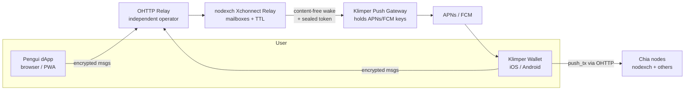

# Xchonnect — XCH Signing Relay Protocol

**Spec for nodexch (relay service) and Klimper (mobile signer), with Pengui as first dApp**

| Field | Value |
|---|---|
| Version | 0.1 |
| Status | Draft — internal, pre-CHIP |
| Normative source | This file (`docs/spec/xchonnect-spec.md` in the xchonnect repository). Copies elsewhere are informative. |
| Changes | See [CHANGELOG.md](CHANGELOG.md) and [PROCESS.md](PROCESS.md) |
| Name | Xchonnect (XCH Signing Relay Protocol); hosted relay product: relayxch (nodexch) |
| Components | nodexch Relay, Klimper Wallet, Push Gateway, Pengui dApp SDK |
| Target | Open protocol (later submitted as a CHIP) + commercial hosted relay in nodexch |

---

## 1. Summary

Xchonnect is an open, push-native, privacy-first transport that lets a dApp (e.g. Pengui) send signing requests to a mobile wallet (e.g. Klimper) and receive signatures back — without persistent WebSockets, without custody, and without the relay learning message contents, Chia addresses, or (with OHTTP) user IP addresses.

Xchonnect is a **transport only**. The method layer reuses **CHIP-0002** (`signCoinSpends`, `getPublicKeys`, …) unchanged, so existing CHIP-0002 dApps can switch transport without new method semantics.

Core idea: phones are never "connected". The relay stores encrypted messages in anonymous mailboxes; a content-free push wakes the wallet; the wallet does one HTTPS round trip and goes back to sleep. This survives iOS/Android background restrictions, where WalletConnect-style WebSocket sessions do not.

---

## 2. Goals and non-goals

### Goals

- **G1 Mobile reliability:** signing requests reliably reach a suspended or closed wallet app on iOS and Android.
- **G2 Non-custodial:** no component other than the wallet ever holds or can derive private keys.
- **G3 Confidentiality:** the relay cannot read or forge requests, responses, or spend data.
- **G4 Minimal metadata:** the relay stores no Chia addresses, public keys, account identities, or IPs; mailboxes are random and rotatable.
- **G5 Open & multi-vendor:** any wallet and any dApp can implement Xchonnect; anyone can run a relay; each wallet vendor keeps control of its own push credentials.
- **G6 Multi-party spends:** supports options and lending flows that combine spends from several parties into one bound spend bundle.
- **G7 Commercially operable:** nodexch can run a metered, SLA-backed hosted relay without identifying end users.

### Non-goals

- Defining spend semantics, fees, coin selection or UI (owned by wallets and dApps).
- Replacing on-chain security (vault recovery, timelocks) — Xchonnect is key-type agnostic and can later carry vault/passkey signatures.
- Anonymity against a global network observer, or against Apple/Google knowing that a device received a push.
- Group chat, general messaging, or file transfer.

---

## 3. Terminology

| Term | Meaning |
|---|---|
| **dApp** | Web or native app requesting signatures (first: Pengui). |
| **Wallet** | App holding keys and signing (first: Klimper). |
| **Relay** | Stateless-ish store-and-forward service for encrypted messages (hosted by nodexch; anyone can run one). |
| **Mailbox** | Anonymous inbox on the relay, addressed by a random ID, accessed with capability tokens. |
| **Read token / write token** | 256-bit random secrets granting read or write access to one mailbox. The relay stores only their hashes. |
| **Push Gateway** | Small service run by the wallet vendor that holds that vendor's APNs/FCM credentials and delivers wake-ups. |
| **Sealed push token** | Device push token encrypted to the Push Gateway's public key, opaque to the relay and dApp. |
| **OHTTP relay** | Independent third-party Oblivious HTTP relay (RFC 9458) that hides client IPs from the Xchonnect relay. |
| **Session** | An established, end-to-end encrypted pairing between one dApp instance and one wallet. |
| **SAS** | Short Authentication String shown on both devices during pairing. |

Key words MUST, SHOULD, MAY follow RFC 2119.

---

## 4. Architecture



### 4.1 Separation of duties

| Component | Sees | Never sees |
|---|---|---|
| OHTTP relay | Client IP, encrypted blob size, timing | Mailbox IDs, content, which Xchonnect relay request |
| Xchonnect relay | Mailbox IDs, ciphertext size, timing, API-key of the *business customer* | Client IP (with OHTTP), content, Chia addresses, device push token |
| Push Gateway | Device push token, that a wake-up happened | Mailbox ID, content, dApp identity |
| APNs / FCM | Device received a push from Klimper | Content (payload is opaque or encrypted) |
| dApp | Its own session, public keys the wallet chose to share | Wallet private keys, device push token |
| Chia node | Signed spend bundle (public anyway after inclusion) | Which device / relay session produced it (if submitted via OHTTP) |

**Requirement:** the nodexch relay service and the nodexch transaction-push (`push_tx`) service MUST run on separate infrastructure with separate logs, so nodexch cannot correlate relay traffic with submitted transactions by timing or IP.

---

## 5. Cryptography

Xchonnect v1 uses only well-reviewed primitives. No custom cryptography.

| Purpose | Primitive |
|---|---|
| Key agreement | X25519 |
| Key derivation | HKDF-SHA256 (RFC 5869) |
| Pairing handshake | HPKE (RFC 9180), mode `psk`, suite DHKEM(X25519, HKDF-SHA256) / HKDF-SHA256 / ChaCha20-Poly1305 |
| Session encryption | XChaCha20-Poly1305 (AEAD, draft-irtf-cfrg-xchacha) with a random 192-bit nonce per message |
| dApp origin signatures | Ed25519 |
| Hashing | SHA-256 |
| Token generation | 256-bit CSPRNG |

### 5.1 Cipher suite agility

- Every envelope carries a protocol version `v`. Suite changes require a new version.
- Implementations MUST reject unknown versions; no downgrade negotiation in v1.

### 5.2 Session keys

After pairing (Section 6), both sides derive:

```
shared   = X25519(own_session_sk, peer_session_pk)
th       = SHA256(transcript of pairing messages)
prk      = HKDF-Extract(salt = pairing_secret, ikm = shared)
k_d2w    = HKDF-Expand(prk, "xchonnect v1 dapp->wallet" || th, 32)
k_w2d    = HKDF-Expand(prk, "xchonnect v1 wallet->dapp" || th, 32)
sas_seed = HKDF-Expand(prk, "xchonnect v1 sas" || th, 4)
```

- Keys are **direction-specific**; a message can never be reflected back.
- Session keys are derived from **ephemeral** keys generated per pairing (forward secrecy across sessions).
- `session.rotate` (Section 9) re-runs key agreement with fresh ephemeral keys. Wallets SHOULD rotate at least every 30 days or 10,000 messages.
- A full double ratchet is a candidate for v2 (Open Question OQ-3).

### 5.3 Envelope format

Messages are CBOR (RFC 8949) using the canonical profile of Section 5.4. Exact CDDL
definitions are in `wire/envelope.cddl`.

**Outer envelope (visible to relay):**

```
Envelope = {
  1: 1,        ; v     protocol version
  2: kind,     ; kind  1 = session message, 2 = pairing reply (Section 6.3)
  3: bstr,     ; n     kind 1: 24-byte random nonce; kind 2: 32-byte HPKE encapsulated key
  4: bstr      ; ct    AEAD ciphertext including the 16-byte tag, padded (see below)
}
```

**Inner plaintext (after decryption, kind 1):**

```
{
  seq:  uint,             // strictly increasing per direction, starts at 1, <= 2^53 - 1
  iat:  uint,             // issued-at, unix seconds
  exp:  uint,             // expiry, unix seconds
  id:   bstr(16),         // random request/response ID
  type: tstr,             // "rpc.request" | "rpc.response" | "rpc.received" | "session.*"
  body: any               // method payload (Section 9)
}
```

- **AEAD:** XChaCha20-Poly1305 under the direction key (`k_d2w` or `k_w2d`, Section 5.2).
- **Nonce:** a fresh 192-bit value from a CSPRNG for every message, carried in field `n`.
  Nonces are never derived from `seq` or any other counter, so restoring older sender
  state cannot cause nonce reuse.
- **AAD:** the 28-byte string
  `"xchonnect"` (9 ASCII bytes) `|| u8 v || u8 kind || u8 direction || recipient_mailbox_id (16 bytes)`,
  where `direction` is `0x01` for dApp→wallet and `0x02` for wallet→dApp.
- **Padding:** the plaintext is the canonical CBOR encoding of the inner map followed by
  zero bytes, so that the ciphertext length (plaintext + 16-byte tag) is exactly one of
  the bucket sizes 1 KiB, 4 KiB, 16 KiB, 64 KiB, 256 KiB (the smallest that fits).
  Receivers MUST reject ciphertexts whose length is not a bucket size, and plaintexts
  whose bytes after the first CBOR item are not all zero. Maximum message size is
  256 KiB of ciphertext.
- **`seq` is for replay protection and ordering only.** Receivers MUST reject:
  decryption failure, `seq` ≤ last accepted `seq` for that direction, `exp` in the past,
  `exp - iat` > 7 days, `iat` more than 5 minutes in the future (clock skew).
- **Sender state loss:** a sender that cannot guarantee that its next `seq` is greater
  than every `seq` it previously sent under the current keys (for example after
  restoring application state from a backup or after storage loss) MUST NOT send further
  messages in that session and MUST re-pair. Because nonces are random, a repeated `seq`
  never weakens confidentiality or integrity; it only causes the receiver to reject the
  message.

### 5.4 Canonical CBOR profile

Specified in Section 5.4 of the wire appendix (`wire/README.md`).

---

## 6. Pairing

### 6.1 dApp identity and domain verification

Each dApp publishes a long-term **origin key** (Ed25519):

```
GET https://<dapp-domain>/.well-known/xchonnect.json

{
  "v": 1,
  "name": "Pengui",
  "origin_keys": [
    { "kid": "2026-10", "pk": "<base64url Ed25519 public key>", "not_after": "2027-10-01" }
  ],
  "icon": "https://<dapp-domain>/icon.png"
}
```

- The file MUST be served over HTTPS from the exact domain being claimed.
- Wallets MUST cache it for no more than 24 hours and MUST re-fetch on pairing.
- Origin key rotation: overlapping keys with `not_after`; compromised keys are removed and all sessions signed by them are revoked by the wallet on next fetch.

### 6.2 Pairing URI

Shown as a QR code (desktop) or opened as a universal/app link (same device):

```
xchonnect:v1?r=<relay base URL>
       &w=<dApp inbox write token>
       &k=<dApp ephemeral X25519 public key>
       &s=<pairing secret, 32 bytes>
       &d=<dApp domain>
       &x=<expiry unix seconds>
       &o=<Ed25519 sig by origin key over (r|w|k|d|x) + kid>
```

All binary values are base64url without padding. Universal links use `https://klimper.app/pair#<same params>` — parameters MUST be in the **fragment** so they are never sent to a web server or logged.

- Pairing URIs MUST expire within 5 minutes.
- The pairing secret `s` is the out-of-band secret that authenticates the handshake; anyone holding the QR within its lifetime can pair, so the dApp MUST show the QR only to the logged-in user and MUST invalidate it after first use.

### 6.3 Handshake

```mermaid
sequenceDiagram
  participant D as dApp (Pengui)
  participant R as Relay
  participant W as Wallet (Klimper)

  D->>R: create mailbox D (hash(rD), hash(wD))
  D-->>W: QR / link: r, wD, dpk, s, domain, x, origin sig
  W->>W: verify x, fetch .well-known, verify origin sig
  W->>R: create mailbox W (hash(rW), hash(wW))
  W->>R: POST to D: HPKE_psk(dpk, psk=s){ wpk, wW, wallet_meta }
  D->>R: GET D (read with rD)
  D->>D: derive session keys, SAS
  D->>R: POST to W: enc{ session.confirm, sas_hash }
  W->>R: GET W
  W->>W: derive keys, compare SAS
  Note over D,W: Both show 6-digit SAS; user confirms match on wallet
  W->>R: POST to D: enc{ session.ready }
```

1. dApp creates mailbox D on the relay; keeps read token `rD`; puts write token `wD` in the URI.
2. Wallet verifies URI expiry, fetches `/.well-known/xchonnect.json` for domain `d`, verifies the origin signature `o`. On failure the wallet MUST abort and MUST NOT show a "continue anyway" option.
3. Wallet shows the **verified domain** prominently (punycode-decoded with homograph warnings) and asks the user to approve pairing.
4. Wallet creates mailbox W and sends its ephemeral public key `wpk`, write token `wW`, and optional metadata to D, sealed with HPKE PSK mode (PSK = `s`).
5. Both derive session keys (Section 5.2) and display a 6-digit SAS from `sas_seed`. The user confirms the match on the wallet. On mismatch the wallet MUST abort and delete the session.
6. After `session.ready`, the dApp MUST discard `s` and the pairing mailbox write token; the wallet MUST discard `s`.

### 6.4 Session record (stored locally only)

| Wallet stores | dApp stores |
|---|---|
| dApp domain, origin key `kid`, session keys, `rW`, `wD`, seq counters, permissions, created/last-used | session keys, `rD`, `wW`, seq counters, the public keys the wallet shared |

The relay stores **no** session record — only mailboxes (Section 7.1).

---

## 7. Relay API (nodexch)

All endpoints are HTTPS, JSON or CBOR bodies, and MUST be reachable via OHTTP (Section 10). The relay is designed so a full database dump reveals no user identity or content.

### 7.1 Data model

| Record | Fields | Retention |
|---|---|---|
| Mailbox | `mailbox_id` (random 128-bit), `H(read_token)`, `H(write_token)`, `push_reg` (optional, sealed), `created_bucket` (day), `last_used_bucket` (day), `customer_id` | Deleted after 30 days inactivity or explicit delete |
| Message | `mailbox_id`, `msg_id`, `ciphertext`, `expires_at` | Deleted on ack or at `expires_at` (max 7 days, default 24 h) |
| Rate counters | `H(write_token)` → counts | Rolling 1 h window, then discarded |

Timestamps are stored at **day granularity** wherever exact time is not needed. The relay MUST NOT store client IPs, User-Agent strings, or Chia data.

### 7.2 Endpoints

```
POST   /v1/mailboxes
       body: { read_token_hash, write_token_hash, push_reg? }
       -> { mailbox_id }

POST   /v1/mailboxes/{id}/messages
       auth: Bearer <write_token>
       body: { v, ct, ttl_s }
       -> 202 { msg_id }            // triggers wake-up if push_reg present

GET    /v1/mailboxes/{id}/messages?wait=<0..25s>
       auth: Bearer <read_token>
       -> 200 [ { msg_id, v, ct } ] // long-poll for web dApps while tab visible

POST   /v1/mailboxes/{id}/ack
       auth: Bearer <read_token>
       body: { msg_ids: [...] }     // deletes messages immediately

PUT    /v1/mailboxes/{id}/push
       auth: Bearer <read_token>
       body: { push_reg }           // register / rotate / remove wake-up

DELETE /v1/mailboxes/{id}
       auth: Bearer <read_token>    // ends session on relay side
```

- Token comparison MUST be constant-time against stored hashes.
- Responses for "unknown mailbox" and "wrong token" MUST be identical (no enumeration oracle).
- `customer_id` is derived from the **business API key** of the hosting customer (e.g. Pengui), never from end users. Self-hosted or community relays MAY run without API keys.

### 7.3 Push registration (wake-ups)

```
push_reg = {
  gateway_url: "https://push.klimper.app/v1/wake",
  sealed_token: HPKE_base(gateway_pk){ platform, device_token, mailbox_hint_key }
}
```

- The **relay never sees the device token**: it is sealed to the Push Gateway's key.
- On new message, the relay sends `POST gateway_url { sealed_token }` — no mailbox ID, no content.
- The gateway decrypts, sends the platform push, and forgets. The gateway MUST NOT log device tokens beyond delivery-failure handling.
- Push payload to the device: either empty with a generic alert ("New signing request"), or an encrypted preview decrypted on-device by a Notification Service Extension (iOS) / FCM data message handler (Android). Lock screen text MUST NOT contain amounts or addresses unless the user opts in.
- iOS: use `interruption-level: time-sensitive` for signing requests; respect user settings.
- Wallets SHOULD use a separate sealed token per session so the relay cannot link sessions by identical blobs (the gateway still can; see Section 13.6).

---

## 8. Mobile flows

### 8.1 Cross-device (desktop dApp, phone wallet)

1. dApp posts `rpc.request` to wallet mailbox W.
2. Relay wakes Klimper via Push Gateway.
3. User taps notification → Klimper opens → fetches W → verifies, simulates, shows → Face ID → signs.
4. Klimper posts `rpc.response` to D **and** (for single-party spends) submits the bundle itself (Section 8.3).
5. dApp receives the response via long-poll or on next visibility change.

### 8.2 Same device (Pengui in mobile browser, Klimper on same phone)

Push is unreliable for "right now" flows on one device. Use an app-link round trip:

1. dApp posts `rpc.request` to W, then opens `https://klimper.app/req#mbx=<hint>`.
2. Klimper comes to foreground, fetches W, signs, posts response.
3. Klimper returns the user via the dApp's registered return URL (`https://pengui.xyz/xchonnect/return`).
4. dApp tab regains visibility, fetches D.

Push remains the fallback if the user switches away.

### 8.3 Submission responsibility

- **Single-party spend:** the wallet SHOULD submit the final bundle itself (via OHTTP, to more than one node) so completion does not depend on a suspended browser tab.
- **Multi-party spend:** the dApp backend (or the last signer) aggregates and submits. Every partial spend MUST be bound (Section 11.2).
- The submitter MUST support at least two independent nodes (e.g. nodexch + one other) to resist withholding.

---

## 9. Method layer

### 9.1 RPC wrapping

```
rpc.request  body: { method: "chip0002_signCoinSpends", params: {...} }
rpc.response body: { request_id, result? , error? { code, message } }
```

- Methods are **CHIP-0002** names and params, unchanged.
- Wallets MUST implement at least: `chip0002_connect`, `chip0002_getPublicKeys`, `chip0002_signCoinSpends`, `chip0002_signMessage`.
- `signCoinSpends` with `partialSign: true` returns only the wallet's aggregated signature for the provided spends.

### 9.2 Session methods

| Method | Direction | Purpose |
|---|---|---|
| `session.confirm` / `session.ready` | both | Pairing completion (Section 6.3) |
| `session.rotate` | either | New ephemeral keys and new mailboxes; old mailboxes deleted |
| `session.permissions` | wallet → dApp | Communicates granted scopes (e.g. which public keys, allowed methods) |
| `session.end` | either | Terminate; both sides delete keys; mailbox deleted |
| `session.ping` | dApp → wallet | Liveness check, no user prompt, rate-limited |

### 9.3 Permissions

Wallets MUST keep per-dApp permissions: allowed methods, which keys/addresses are exposed, and optional per-session limits (max value per request, per day). Default: expose a single fresh key, no auto-approval.

---

## 10. IP privacy (OHTTP)

- Klimper and the Pengui SDK MUST support sending all relay and node requests via **Oblivious HTTP** (RFC 9458).
- The OHTTP relay MUST be operated by an independent organization under contract not to collude or log request bodies; the Xchonnect relay runs the OHTTP **gateway**.
- The OHTTP key configuration MUST be fetched and pinned by clients; key rotation announced via `/.well-known/ohttp-keys`.
- Hosted tiers include OHTTP by default; self-hosted relays MAY omit it but MUST then document that they see client IPs.
- Without OHTTP the relay MUST still not persist IPs; edge rate limiting uses in-memory, short-lived counters only.

---

## 11. Wallet requirements (Klimper)

### 11.1 Signing safety

1. **Independent simulation:** Klimper MUST run every requested spend locally with the Wallet SDK, compute output conditions, and display the **net effect** per asset (sent, received, fees, locked/collateral, expiry). It MUST ignore dApp-provided labels for amounts and recipients.
2. **Signature scope:** sign only `AGG_SIG_ME` (and coin-bound `AGG_SIG_*` variants) for the wallet's own keys. `AGG_SIG_UNSAFE` MUST be refused by default and only allowed per-dApp with an explicit, scary confirmation.
3. **No blind signing:** if a spend cannot be decoded (unknown puzzle), show "Unknown contract", the raw puzzle hash, and require a second confirmation; MAY be disabled entirely by user setting.
4. **Biometric per signature:** every signature requires Face ID / fingerprint; no "remember for N minutes" in v1.
5. **Spending limits:** user-configurable per-dApp and per-day limits enforced in-app.
6. **Network check:** verify the genesis challenge matches the expected network; refuse mismatches.

### 11.2 Multi-party spend binding (options, lending)

- Before signing a partial spend, Klimper MUST verify that the user's spend **asserts** the counterparty side (via `ASSERT_COIN_ANNOUNCEMENT` / `ASSERT_PUZZLE_ANNOUNCEMENT` or `SEND_MESSAGE` / `RECEIVE_MESSAGE`), so the user's spend cannot be included without the expected counter-spend.
- If binding is missing, Klimper MUST refuse with a clear error. (Offers already provide this via settlement payments.)

### 11.3 Key storage

- Seed generated on device; BLS keys stored encrypted with a key held in Secure Enclave (iOS) / StrongBox or hardware-backed Keystore (Android), requiring biometric authentication to unwrap.
- Decrypted key material lives in memory only during signing and is zeroized afterwards.
- Seed backup flow at onboarding; optional import of existing seeds (with a warning that the same key then lives in two apps).
- Session keys for Xchonnect are stored in the platform keychain, separate from signing keys.

### 11.4 App integrity

- Reproducible builds, open-source signing core, minimal dependencies with pinned versions and SBOM.
- Optional App Attest (iOS) / Play Integrity (Android) when registering with the Push Gateway, to limit fake clients. Not required for relay access (would hurt privacy and openness).

---

## 12. dApp requirements (Pengui and SDK)

- Publish `/.well-known/xchonnect.json`; protect origin keys in an HSM or cloud KMS; rotate yearly.
- Display the pairing QR only inside an authenticated page, single use, ≤ 5 min.
- Construct multi-party bundles with mandatory binding (Section 11.2); never request `AGG_SIG_UNSAFE`.
- Use long-poll only while visible; on `visibilitychange` re-fetch mailbox D.
- Strict CSP, Subresource Integrity, no third-party scripts on signing pages; ideally serve the signing frontend as an immutable, content-addressed build.
- Do not log or transmit wallet public keys to analytics.

---

## 13. Security considerations

### 13.1 Assets

User funds; private keys; session keys; transaction intent (what a user is about to do); user identity and IP; relationship between a device and Chia addresses; availability of time-critical actions (exercise, repay, liquidation).

### 13.2 Adversaries

| ID | Adversary | Capability |
|---|---|---|
| A1 | Malicious or compromised dApp frontend | Sends arbitrary well-formed requests through a valid session |
| A2 | Phishing site | Shows its own QR / link, impersonates a known dApp |
| A3 | Compromised or curious relay operator (incl. nodexch insiders) | Reads DB, logs, traffic; drops, delays, replays, reorders |
| A4 | Network attacker | Observes/modifies traffic outside TLS endpoints |
| A5 | Push provider (Apple/Google) or compromised Push Gateway | Sees device-level push metadata; could suppress or spoof pushes |
| A6 | Thief / coercer with physical device | Has the phone, maybe the passcode |
| A7 | Supply-chain attacker | Malicious dependency, build server, or app update |
| A8 | Spammer / DoS attacker | Floods relay or a specific mailbox |
| A9 | Legal compulsion against the relay operator | Can force disclosure of stored data |

### 13.3 Threats and mitigations

| # | Threat | Adversary | Mitigation | Residual risk |
|---|---|---|---|---|
| T1 | Draining spend disguised as a normal action | A1 | Local simulation + net-effect display (11.1), no dApp labels trusted, spending limits | User approves without reading; mitigated by clear UX and limits |
| T2 | User's partial spend used without counterparty delivery | A1, A3 | Mandatory binding via announcements/messages (11.2); wallet refuses unbound partials | Bugs in binding verification → audit priority |
| T3 | Phishing pairing | A2 | Origin signature + `.well-known` verification, domain display with homograph checks, SAS comparison, 5-min single-use QR | Lookalike domains the user accepts consciously |
| T4 | Relay reads or forges messages | A3, A4 | E2E AEAD with direction keys; relay has no keys; TLS on top | None for content |
| T5 | Replay / reorder of requests | A3 | Monotonic `seq` inside the AEAD, `exp`, random `id`, reject duplicates; replay protection does not depend on nonce uniqueness | Sender state rollback forces a re-pair (5.3) |
| T6 | Relay drops or delays time-critical requests | A3, A8 | Wallet fetches pending on every open; dApp shows "not delivered" status; fallback relay; puzzles designed with timing buffers; keeper-spendable settlement paths | Short windows remain sensitive; design buffers ≥ hours |
| T7 | Withholding/front-running signed bundles | A3 | Wallet submits itself to ≥ 2 nodes via OHTTP; relay never sees plaintext bundles | Public mempool exposure exists on any chain |
| T8 | Notification fatigue / approval spam | A1, A8 | Only paired sessions can write; per-mailbox rate limits; wallet rate-limits prompts per dApp; never batch-approve | — |
| T9 | Device-to-address linkage by relay | A3, A9 | No addresses/pubkeys stored, random rotating mailboxes, sealed push tokens, OHTTP, day-granular timestamps, padding | Timing correlation by a global observer |
| T10 | Correlation of relay traffic with `push_tx` | A3 | Separate infra/logs for relay and tx push; wallet submits via OHTTP and to multiple nodes | Insider with access to both systems — process controls + audits |
| T11 | Push provider learns usage patterns | A5 | Opaque/encrypted payloads, generic lock-screen text | Apple/Google always know a push occurred |
| T12 | Spoofed push leading to phishing UI | A5 | Push only triggers a fetch; all content comes from authenticated, encrypted mailbox; push text never drives a signing decision | — |
| T13 | Stolen phone | A6 | Biometric per signature, hardware-wrapped keys, spending limits, remote session revocation from another paired device (v2) | No on-chain recovery without vaults — documented to users |
| T14 | Coercion ("$5 wrench") | A6 | Daily limits; future vault integration with timelocks | Out of scope for standard keys |
| T15 | Malicious app update or dependency | A7 | Reproducible builds, open-source core, pinned deps + SBOM, 2-person release signing, staged rollouts | High impact — highest audit priority |
| T16 | Relay DoS | A8 | Edge rate limits, proof-of-work on mailbox creation for keyless use, quotas per customer API key, multi-region, documented fallback relay | Targeted outages possible |
| T17 | Mailbox enumeration / token guessing | A3, A8 | 128-bit IDs, 256-bit tokens, hashed storage, identical error responses, constant-time compare | — |
| T18 | Compromised dApp origin key | A1 | Origin keys in HSM/KMS, short `not_after`, revocation via `.well-known`, wallets re-fetch at pairing | Window until revocation |
| T19 | Legal demand for user data | A9 | Data minimization means there is nothing useful to hand over; publish a transparency report and warrant canary | Future compelled logging — mitigated by OHTTP split and open-source relay |
| T20 | Crypto downgrade / implementation bugs | A4 | Single fixed suite per version, random 192-bit AEAD nonces (no nonce reuse on state rollback), test vectors, fuzzing of CBOR/envelope parsers, external audit | — |

### 13.4 Security invariants (MUST always hold)

1. No relay, gateway, or dApp component ever receives a private signing key or seed.
2. The relay cannot decrypt any envelope, even with full database and log access.
3. A signature is only produced after on-device simulation, user display, and biometric approval.
4. A partial signature is never produced for an unbound multi-party spend.
5. The relay never stores Chia addresses, public keys, device push tokens, or client IPs.

### 13.5 Logging policy (nodexch)

- Allowed: aggregate counters (requests/min, error rates), per-customer usage totals for billing, latency histograms.
- Forbidden: IPs, User-Agents, mailbox IDs in logs, token values, ciphertext, per-request timestamps tied to mailboxes.
- Log retention ≤ 14 days; security incident logs handled under a documented exception process with deletion afterwards.

### 13.6 Known limitations (be honest in public docs)

- Push Gateway operator can link multiple sessions of the same device via the device token.
- Apple/Google see that a device receives Klimper pushes.
- Without OHTTP, the relay operator can see IPs at the network layer even if it does not store them.
- Standard (non-vault) keys have no recovery or rotation: a lost seed or stolen key cannot be remedied on-chain.

---

## 14. Privacy considerations (data inventory)

| Data | Where | Purpose | Retention |
|---|---|---|---|
| Ciphertext messages | Relay | Store-and-forward | Until ack, max 7 days |
| Mailbox ID + token hashes | Relay | Routing / access control | 30 days inactive |
| Sealed push token | Relay | Wake-up | With mailbox |
| Device push token | Push Gateway (transient) | Deliver push | Not stored beyond delivery |
| Business API key usage | Relay billing | Metering | Per billing law |
| Session keys, permissions | Wallet / dApp devices | E2E encryption | Until session end |
| Signed bundles | Chia network | Settlement | Public, permanent |

GDPR: the relay processes pseudonymous data at most; hosted EU tiers pin storage and processing to EU regions with a DPA for business customers.

---

## 15. nodexch product features

| Tier | Features |
|---|---|
| **Community** (free) | Public relay, fair-use limits, OHTTP via shared partner, best-effort uptime |
| **Builder** | API key, higher quotas, usage dashboard (aggregate only), email support |
| **Pro** | 99.9 % SLA, EU or region-pinned relay, hosted Push Gateway for the customer's own wallet app, webhooks integration ("on chain event X, send signing request to session Y"), priority support |
| **Enterprise** | Dedicated relay + custom domain, 99.95 % SLA, self-hosted license, security review package (audit reports, SBOM, pentest summary), DPA + custom retention |

**Webhook-triggered signing requests (nodexch differentiator):** a dApp registers a nodexch webhook (e.g. collateral ratio below threshold, option nearing expiry) bound to a Xchonnect session. When it fires, nodexch posts an encrypted, pre-built request to the wallet mailbox. The dApp encrypts the request template at registration time; nodexch only stores ciphertext and the trigger condition.

Metering is per business customer (API key), by active mailboxes and messages. End users are never identified or billed.

---

## 16. Operations

- **Deployment:** at least two regions per tier; stateless API nodes; mailbox store with encryption at rest and TTL eviction.
- **Keys:** TLS and OHTTP gateway keys in KMS/HSM; Push Gateway platform credentials (APNs .p8, FCM service account) in HSM, accessible only to the gateway service.
- **Secure SDLC:** threat model review per release, dependency scanning, fuzzing of parsers, signed commits, protected branches.
- **Audits:** external cryptography and implementation audit before public launch; annual re-audit; public bug bounty.
- **Incident response:** documented runbooks for key compromise (origin keys, OHTTP keys, push credentials), relay compromise, and malicious-update scenarios; user-facing disclosure within 72 hours.
- **Transparency:** publish relay source code, logging policy, data inventory, and a yearly transparency report.

---

## 17. Versioning and extensibility

- `v` in every envelope and pairing URI; one cipher suite per version.
- New methods are added at the CHIP-0002 layer, not in Xchonnect.
- Extension fields in inner plaintext MUST be ignored if unknown; outer envelope has no extension fields.
- Future key types (passkey/secp256r1 members, Chia vault signatures, Chia Signer) are carried by the method layer without transport changes.

---

## 18. Milestones

| Phase | Scope | Exit criteria |
|---|---|---|
| **M0 Spec** | This document, test vectors, threat model review | Internal review done; open questions decided |
| **M1 Core** | Rust relay (mailboxes, TTL, rate limits), Rust/WASM + TS crypto library, CBOR envelope, pairing | Interop tests pass between TS dApp lib and wallet lib |
| **M2 Klimper signer** | Pairing UI, SAS, simulation & net-effect display, BLS key storage, biometric signing, `signCoinSpends` | Testnet: Pengui → Klimper → mempool end-to-end |
| **M3 Push** | Push Gateway (APNs + FCM), sealed tokens, NSE encrypted previews, same-device app-link flow | Requests reach suspended/closed app on iOS + Android reliably |
| **M4 Privacy** | OHTTP gateway + independent OHTTP relay partner, padding, separation from `push_tx` infra, logging policy enforced | Privacy invariants verified in staging |
| **M5 Multi-party** | Bound partial signing, options and lending flows in Pengui, wallet binding checks | Testnet options/lending trades settle; unbound partials refused |
| **M6 Audit & launch** | External audit, bug bounty, public docs, mainnet beta | Audit findings fixed; mainnet with limits |
| **M7 Standard & product** | CHIP submission, nodexch tiers, webhook-triggered requests, outreach to Sage and Chia Network | CHIP published; first paying customer |

---

## 19. Open questions

- **OQ-1** Trademark check for "Xchonnect" and "relayxch" (EUIPO/USPTO, app stores), domain availability, and universal link domain. Third-party names (Chia, CHIP-0002, Chia Wallet SDK) are only referenced descriptively.
- **OQ-2** CBOR vs JSON for the inner payload (CBOR chosen for size; JSON easier for third-party adoption).
- **OQ-3** Double ratchet (per-message forward secrecy) in v1 or v2?
- **OQ-4** Exact CHIP-0002 method set and `partialSign` semantics — confirm against the current CHIP-0002 text and Sage's implementation.
- **OQ-5** Independent OHTTP relay partner selection and contract terms.
- **OQ-6** Keyless community relay abuse controls: proof-of-work vs privacy-pass-style tokens.
- **OQ-7** Remote session revocation and multi-device wallets (v2).
- **OQ-8** Path to vault integration (passkey/secp256r1 members, Chia Signer) once Chia publishes a signer protocol/API.
- **OQ-9** Push Gateway shared hosting for third-party wallets: how to keep vendor credential isolation provable.

---

## 20. References

- CHIP-0002: dApp protocol (Chia Network CHIPs repository)
- RFC 9180: Hybrid Public Key Encryption (HPKE)
- RFC 9458: Oblivious HTTP
- RFC 5869: HKDF
- RFC 8949: CBOR
- RFC 8439: ChaCha20 and Poly1305
- draft-irtf-cfrg-xchacha: XChaCha20 and XChaCha20-Poly1305
- RFC 7748: X25519; RFC 8032: Ed25519
- Chia Wallet SDK (Rust, WASM bindings)
- Apple Push Notification service and Notification Service Extensions; Firebase Cloud Messaging data messages
- Web Push (RFC 8030) and Matrix push gateway design (push gateway model)
